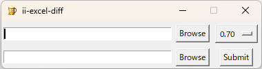
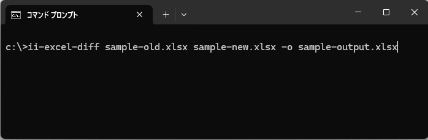

# ii-excel-diff
Excel diff tool for Windows (GUI + CLI)

ii-excel-diff is a Windows tool for comparing Excel files.

## Features
- Visual Excel diff
- GUI and CLI support

## GUI Image

## CUI Image

## Sample Input/Output Filles

Excel files are included in the sample directory.

## Trial

Get the trial from Release.

This software can be used for a 3-month trial period.

After the trial period, a license key is required for continued use.

## Production

Please purchase the product from [Vector](https://www.vector.co.jp/soft/winnt/business/se527497.html) or [note](https://note.com/just_vole1456/n/n32ec4d34431b).

Please register the license obtained during the purchase process with this software.

## Others

[HP](https://yaonasu.blogspot.com/2025/11/ii-excel-diff.html)

